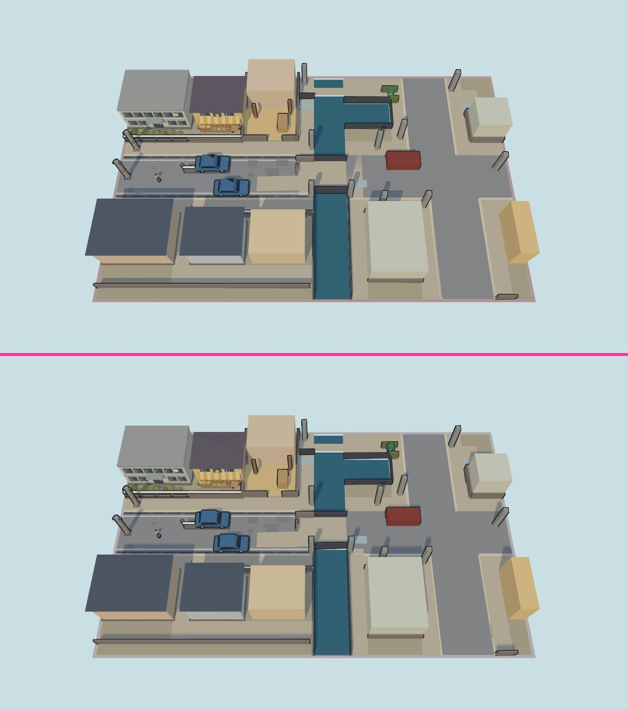
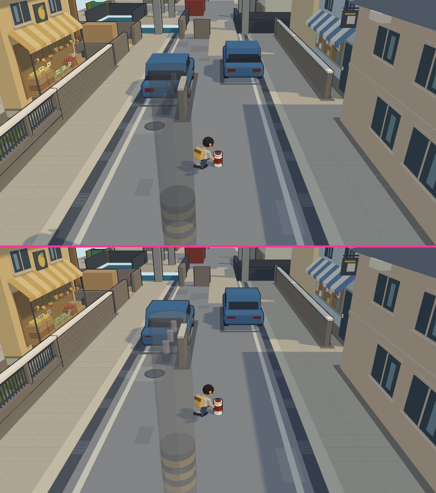
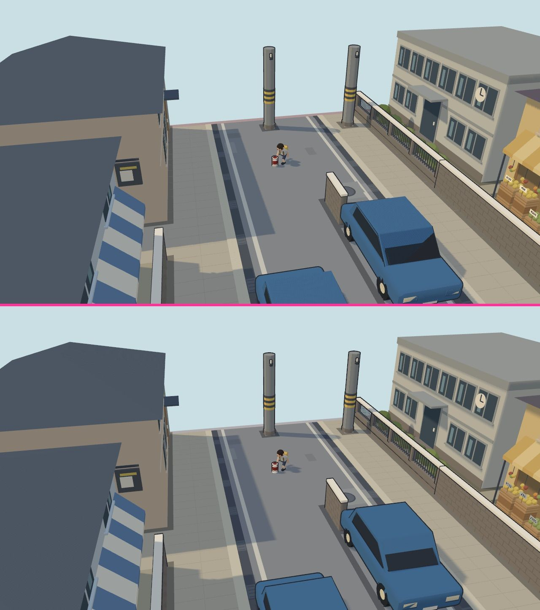
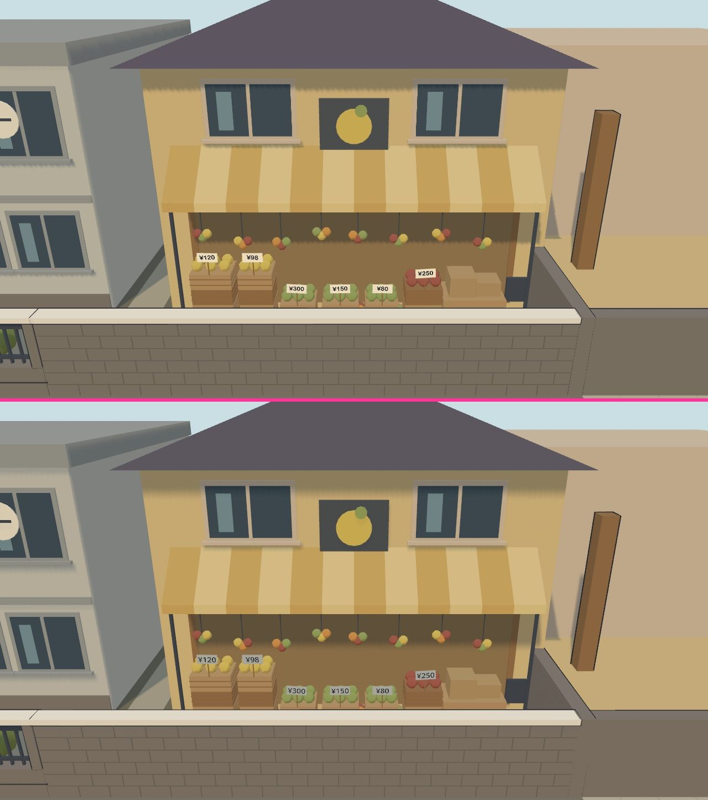
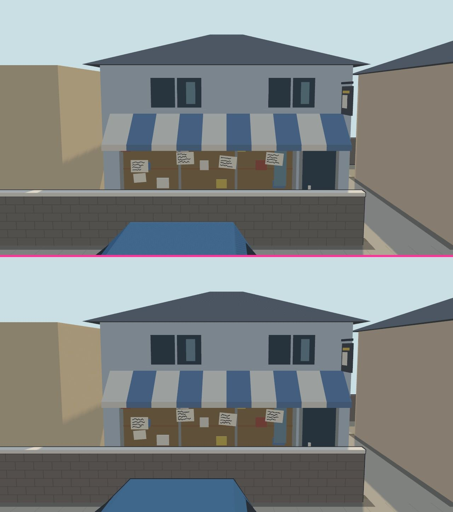
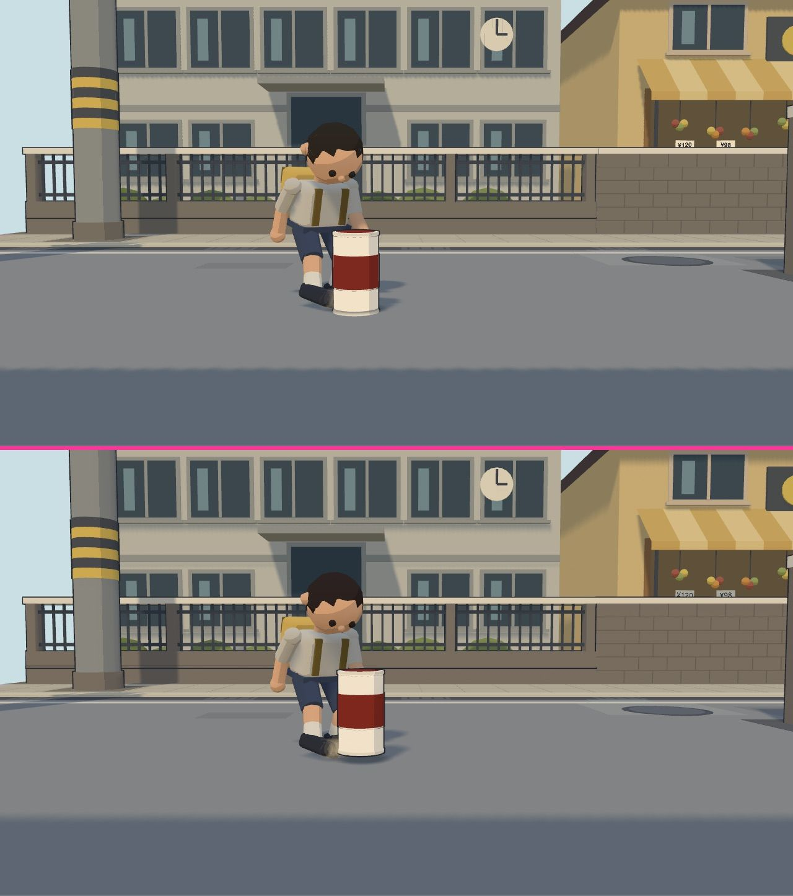
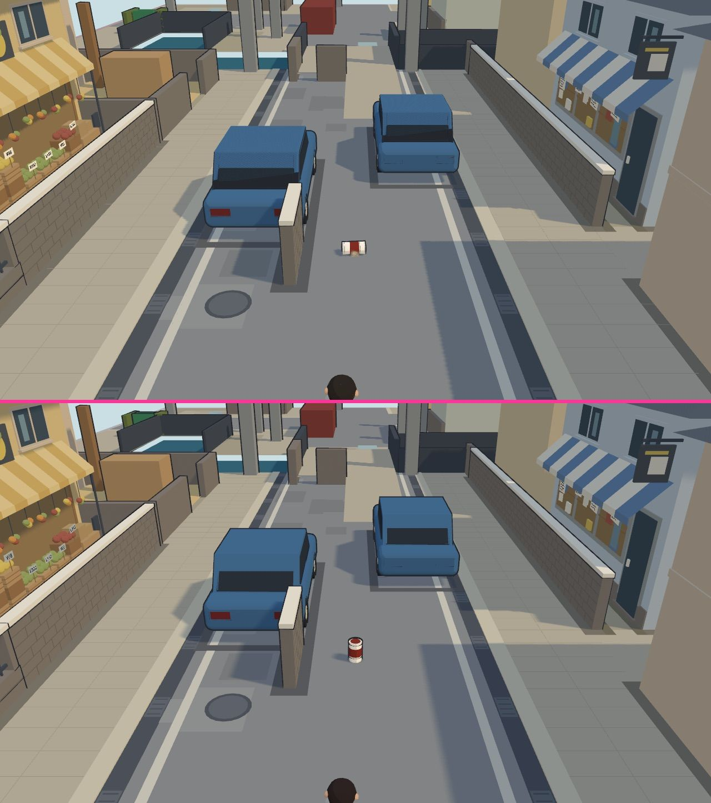
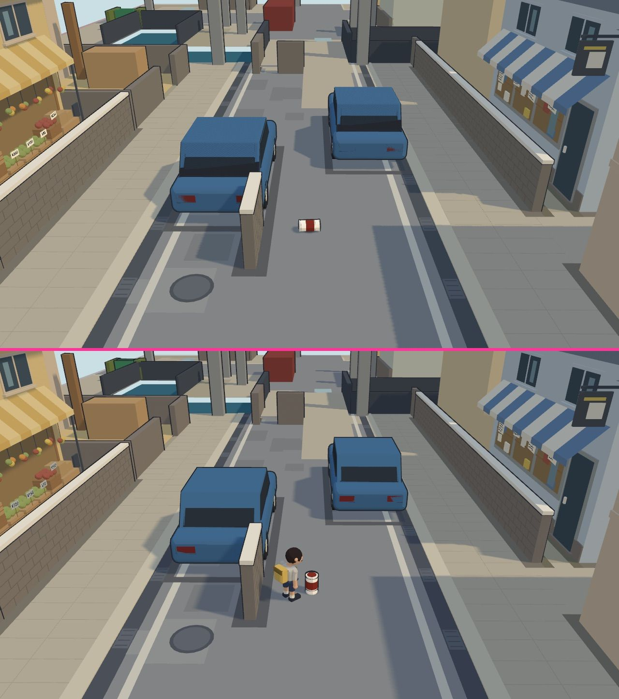

# Case study: a three.js game scene ported to Godot 4 by an AI agent

This is the record behind the skill. One AI agent (a Sonnet-class model) ported a small three.js scene and its game logic to Godot 4.7, compared the two side by side, and measured the physics. This page is written from the agent's side, from the agent's own reports, and it keeps the failures. Numbers come with their conditions. Anything not measured says so.

The game is a prototype in which a boy kicks a can along a street, golf style. A street in front of a school and a shopping street are modeled. The game's name, coordinates, colors and design numbers are left out on purpose; only measurements and observations are kept.

## 1. Summary

- **What was ported:** a procedurally built street (buildings, shops, cars, poles, a fence), a boy, a can, three cameras, synthesized sound, and the can's physics. About 6,400 lines of GDScript in 70 files (including tests, a physics lab and tools), five shaders.
- **How it was carried:** not through glTF. The agent ported the scene-building code function by function, in the same order, drawing random numbers in the same order, so the Godot scene had the same windows, crates and stains as the three.js one. This is the case behind carrying path B in `SKILL.md`. The glTF path (path A) was not used in the case; it is covered by the examples in this repository instead.
- **Time:** about 79 minutes from the brief being committed to the merge. That includes a planning stage, a wait for approval, and the reviewer's checks. The agent's own working time was not measured.
- **Result, rendering:** thirteen fixed viewpoints were captured in three.js and in Godot and compared. Road brightness L* 54.7 in Godot against 55.0 in three.js; shadow-to-light ratio 0.576 against 0.578. The remaining differences are edges of shadows, thickness of outlines, a few shapes, and what physics did differently.
- **Result, physics:** with engine-derived settings, Jolt kept the can within 0.02 m of the reference in 2 of 8 cases and Godot Physics in 0 of 8. After fitting three settings to those same eight cases: 3 of 8 and 3 of 8. A prediction world fed the can's state differed from the real path by up to 13 mm. Details in `physics-numbers.md`.

## 2. Setting

| Item | Value |
| --- | --- |
| Source | three.js 0.185.1 (TypeScript, Vite); a street scene with about 40,000 triangles and six material types, three cameras, a boy figure, a can |
| Target | Godot 4.7.stable.official, GDScript only, Jolt physics (Godot Physics measured as well) |
| Machine | Apple M1, 16 GB, macOS 27.0; Metal, Forward+ renderer |
| Agent | a Sonnet-class model, working in two stages: a read-only plan, then implementation after approval |
| Brief | Build the same scene in Godot with GDScript and the built-in physics. Compare it with the three.js build. Keep the three.js build unchanged. |
| Size comparison | three.js: view, camera, audio, app and capture code about 4,150 lines. Godot: scripts about 4,070 lines plus about 130 lines of shaders |

## 3. How the port went

The plan put the measuring tools before the content, and probes before assumptions.

1. **Probes first.** Eleven short scripts checked what Godot 4.7 actually does before anything was built: API and defaults, friction and bounce combination, the first physics step, impulses on a frozen body, `--fixed-fps`, whether the log names the engine, `override.cfg`, drawing in a window, text rendering, the clip-space convention of shader output, and the light unit. Three results were not in the plan: `continuous_cd` is a boolean and not a three-way setting; an impulse before the first physics step is ignored in both engines; and a vertex shader that overrides `POSITION` has to flip y (clip space points down).
2. **Physics comparison before visuals.** The eight launch conditions were run first, because the question "will the can stop where the reference stops" decided how the rest would be judged.
3. **Mechanical port.** Each three.js function became one GDScript function, in the same order, with the same random number sequence (a `mulberry32` port, pinned by a test against values from Node). Tables such as the color palette were ported with a test that reads the TypeScript source as text and compares line by line. Colors, parts and cameras then needed little fixing.
4. **A test runner without add-ons.** A 60-line runner and a 40-line assertion helper; no `class_name`, no addon downloads. Headless runs: 83 tests with 5,182 checks passed in 13.4 s (0.7 s with `--fixed-fps 120`).
5. **Capture and compare.** The same thirteen viewpoints in both. Godot images were drawn into a `SubViewport` so their size was fixed. Every comparison image was opened and looked at by the agent.

The images found four defects that numbers had not: a car roof turned black (a back-face outline shell drew over a reversed-winding surface), outlines missing on the top and bottom edges (clip-space y), jagged shadow edges (shadow range settings), and poles without shadows or outlines (a transparent material kept at full opacity). All four are in `skills/threejs-to-godot-port/references/pitfalls.md`.

## 4. Side by side

Each image has the three.js render on top and the Godot render below, separated by a magenta line, both 1280 by 720 from the same camera. Five images show rendering parity. Three show behavior that differs because Godot's physics decided the can's motion.

### Rendering parity

**`overview.jpg`: the whole scene from above.**
Matches: the layout, building colors, the canal, cars and poles.
Differs: shadow edges are hard and stepped in three.js and soft in Godot. In the Godot image, poles and the right-hand building throw shadows well away from the street; three.js shows few of them there. The three.js shadow box is a fixed region around the street; the Godot shadow range was extended to 140 m for high views (known settings; the link between those settings and this picture was not tested). A thin comb-like pattern along one wall edge appears only in the three.js image.

**`start-behind.jpg`: the play viewpoint, behind the boy.**
Matches: can, boy, road, buildings, and the way a pole in front of the can is faded to a ghost in both.
Differs: shadow edges are softer in Godot (known: a different shadow method). A car's rear window and roof read a little differently.

**`school-overview.jpg`: the school side of the street.**
Matches: fence, school building, two poles, blue cars, the reflected wall.
Differs (looked at enlarged): the three.js car shows a fine diagonal hatching on its sloped rear panel; the Godot car is smooth. The hatching looks like shadow-map self-shadowing; this was not checked. The car's dark rear window is a chamfered shape in three.js and a plain rectangle in Godot, so the car geometry itself differs slightly. The cross-arm insulators on the poles look different, and the out-of-bounds strip at the top is fainter in Godot (reported by the agent).

**`greengrocer-front.jpg`: a shop front behind a low wall.**
Matches: awning, hanging fruit, crates, price tags. The digits and the yen sign are legible in both; no boxes in place of glyphs, using Godot's default font.
Differs: the tag backing is white in three.js and gray in Godot. The agent suspected the awning's shadow and did not check it.

**`stationery-front.jpg`: another shop front.**
Matches: the striped awning, the hand-drawn paper on the window, the hanging sign, even the car roof at the frame's bottom edge. Nearly identical.
Differs: the shadow on the left wall is softer in Godot. Outline width was raised from 2.0 to 2.4 pixels in Godot because 2.0 looked faint there.

### Behavior that physics changed

**`kick-side-contact.jpg`: the moment the foot meets the can, from the side.**
Matches: the boy's pose, the foot, the street behind.
Differs: the Godot can has already moved one physics step (up and to the right); the dust at the foot is visible in Godot. The agent applied the impulse in the contact step, and the engine steps physics before the frame is drawn. A rendering comparison would call this a bug; it is a timing decision to record. See pitfall P19.

**`follow-landing.jpg`: the following camera as the can lands.**
Matches: street, cars, awnings, distance, and roughly where the can is.
Differs: in three.js the can lies on its side, because the game's own rules toppled it on landing. In Godot it stands. Built-in physics has no rule to topple it. The three.js car roofs show the same hatching as above.

**`return-mid.jpg`: after the can stopped, the camera returns to the next aim.**
Matches: the street and buildings.
Differs: in Godot the can stopped sooner and the boy already stands next to it. In three.js the boy is not yet in the frame. Different physics gave a different stop time, so the state of the game, and everything driven by it (camera, boy), moved on. When physics differs, compare at event markers and not at clock times.

## 5. Numbers

Rendering, measured by the agent on the same viewpoints in both builds (the first value is Godot, the second three.js; the points are fixed patches of road, pavement and shadow):

| Quantity | Godot | three.js |
| --- | --- | --- |
| Road brightness L* (several viewpoints) | 54.7 | 55.0 |
| Road to pavement step in L* | 12.7 to 13.1 | 12.3 to 12.7 |
| Shadow to light ratio (near viewpoints) | 0.576 | 0.578 |
| Shadow to light ratio (school-side view / whole-scene view) | 0.615 / 0.757 | 0.676 / 0.747 |
| Orange-hued pixels (13 viewpoints) | 0 to 0.5 percent (never above 0.7) | 0 to 0.5 percent (never above 0.7) |
| Dark pixels along a pole's outline | 293 | 282 |
| Camera position and orientation difference | within 7e-5 m and 0.031 degrees | |

One difference was not explained: the contrast between the can and its surroundings was 38.6 in Godot and 17.9 in three.js in a side view where a bright wall sits behind the can. The agent thought the three.js measurement window might have been placed differently, and did not check.

The agent's rule of thumb after this case: a shadow ratio that works at a near viewpoint will not hold at a far one, because the ratio is read from a small patch that mixes lit and shaded pixels at a distance.

## 6. Pitfalls hit

| In `pitfalls.md` | In one line |
| --- | --- |
| P01 | `Vector3` is single precision |
| P02, P03, P04 | untyped `:=`, Packed array copy, `:` in node names |
| P05 | the first physics step ignores impulses |
| P06 | clip space y is flipped in Godot |
| P07 | light energy needs a division by PI |
| P08 | reversed winding plus a back-face hull gives a black roof |
| P09 | shadow range works differently |
| P10 | a transparent material at full opacity loses shadow and outline |
| P11 to P14 | headless does not draw; engine switching; `--fixed-fps`; `class_name` |
| P15 to P19 | friction and bounce combination; rolling does not stop; thin bodies; repeat differences; one-step offsets |

## 7. Notes for the next agent

- Build the measuring tools first. The comparison harness decided what counted as done.
- Probe before you assume. Three things in eleven probes were not what the plan expected or had not been known.
- Port mechanically, test the tables. A test that reads the source language as text and compares to the port is cheap and strong.
- Open every comparison image. Four defects, listed above, were found only by opening the images.
- Report differences you could not explain as unexplained. Two such differences stayed in this case.
- Equal pictures do not mean equal behavior. The three picture pairs in "Behavior that physics changed" look different for reasons that are not rendering.
- GDScript gave no compile-time feedback for typed expressions; many errors appeared at run time. In return, edit-to-test took seconds and a whole headless world ran in tests.

## 8. Limits

One scene, one machine (Apple M1, macOS), one three.js version (0.185.1), one Godot version (4.7.stable). Frame rate, other operating systems, other physics engines in Godot, swept tunneling and many bodies were not measured. The tuned physics numbers are fits to the reported cases. The agent's sense of how long the work took was not recorded; the 79 minutes is a git timestamp interval.
